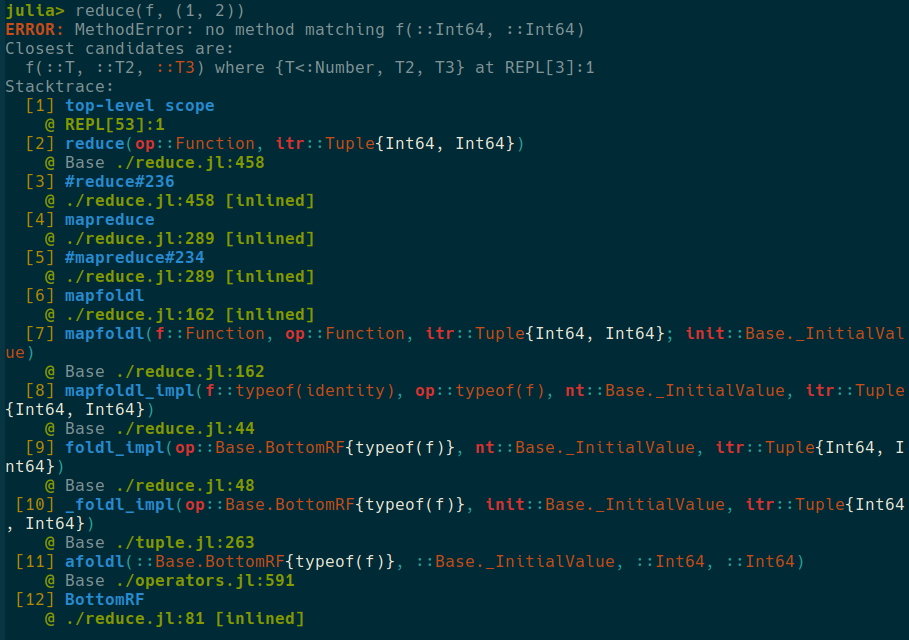

# NoRainbows

[](https://Arkoniak.github.io/NoRainbows.jl/stable)
[](https://Arkoniak.github.io/NoRainbows.jl/dev)
[](https://github.com/Arkoniak/NoRainbows.jl/actions)
[](https://codecov.io/gh/Arkoniak/NoRainbows.jl)

# Usage

```julia
using NoRainbows

# Setup colors
NoRainbows.set_framecolor_map(default = NoRainbows.Color("green:bold"), frameno = NoRainbows.Color("yellow"))
NoRainbows.set_signature_map(default = NoRainbows.Color("red:bold"), funcname = NoRainbows.Color("blue:bold"))
NoRainbows.set_tuplecall_map(default = NoRainbows.Color("red:bold"), doublecolon = NoRainbows.Color("cyan"), comma = NoRainbows.Color("cyan"), brackets = NoRainbows.Color("cyan"), semicolon = NoRainbows.Color("cyan"))
NoRainbows.set_speclinfo_map(default = NoRainbows.Color("blue:bold"))
NoRainbows.set_argtype_map(default = NoRainbows.Color("light_red"), paramtypearg = NoRainbows.Color("white"))

NoRainbows.GLOBAL[] = NoRainbows.GlobalOptions(reverse = true)

# declare function and produce an error
function f(x::T, y::T2, Z::T3) where {T <: Number, T2, T3}
    sum(x)
end

reduce(f, (1, 2))
```

This generate the following stacktrace (solarized colorscheme is used, you may see different result in a different colorscheme)


