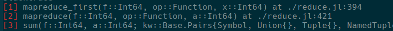

# Colorschemes

There are four main elements of the frameline which can be colorized:

* Frame number
* Module name
* Filepath of the file which generates corresponding frame line
* Function and it's signature

## Frame number

Frame number is an (optional) element, which is usually added at the beginning of the frame line and is represented as `[<frameline number>]`. It's colormap can be changed with the help of `NoRainbows.set_framenumber(; frameno)`.

For example

```julia
NoRainbows.set_framenumber(frameno = "red")
```


```julia
NoRainbows.set_framenumber(frameno = "blue:underline")
```


## Module name

There are two possible ways to set color of the `Module`. They can either be fixed per module, which is useful, when you want to highlight any particular module. Or they can rotate cyclicaly through the predefined set of colors.

### Fixed module colors

Dictionary of currently defined colors can be obtained and manipulated with the `NoRainbows.get_module_fixed()`. Additionaly to usual dictionary operations, one can redefine whole mapping with the help of `NoRainbows.set_module_fixed(d::Dict)`, for example

```julia
using MyPkg

NoRainbows.set_module_fixed(Dict(MyPkg => "red:bold", Base => "yellow"))
```


## Filepath

Filepaths (and some extra information) are set with the `NoRainbows.set_filepath` function.

For example

```julia
NoRainbows.set_filepath(filepath = "red:underline", colon = "blue", lineno = "yellow", inlined = "magenta:bold")
```


As one can see, `filepath` is the color of the file path, `colon` is the color of the colon after file path, `lineno` is the color of the number after colon, and `inlined` is the color of the `[inlined]` keyword which appears if function is inlined.


Additionaly there is a special `default` argument, which, when it is set, applies to all arguments, if they are not listed explicitly.

```julia
NoRainbows.set_filepath(default = "red:underline", lineno = "blue:bold")
```

