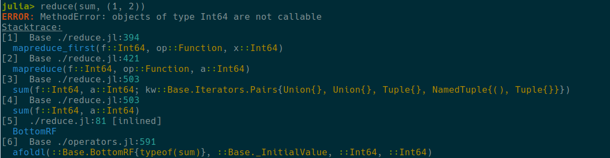
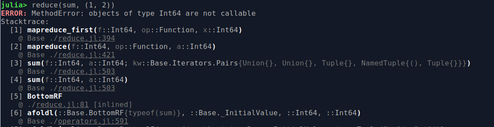
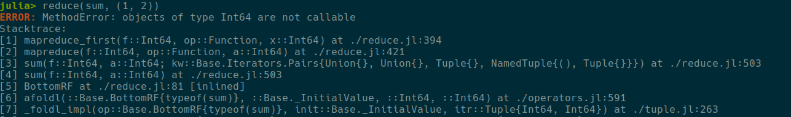

# Frameline format

Main function to define format of the frameline is `NoRainbows.format_frameline`. It accepts a string, which encodes how final frameline will look like. This string usually has the following format: `"{token1} intermediate text {token2} intermediate text {token3}"`, for example `"{frameno:lalign} {module}@:cyan{filepath}\n  {function}"`

Following tokens are supported:

- `frameno`: incremental number of the frame, goes from 1 to the number of lines in stackframe. Visually represented as `[1]`, `[2]` etc. Can be aligned on the left or on the right, in this case one should use one of the modifiers `:lalign` or `:ralign`, for example `{frameno:ralign}`.
- `module`: name of the module, which produces this line. It automatically adds space after last symbol.
- `filepath`: name of the file (together with the row number) which produces this line.
- `function`: function definition, which produces this line.

Intermediate text usually go as it is, but it can be enclosed in curly brackets (in this case they are ignored). Text can be anything other than 4 predefined words described above and it can have color modifiers. Also, one of the text tokens can have `:lalign` or `:ralign` modifier, in this case it is aligned with `frameno`.

## Examples of frameline format

### Filepath based

```
NoRainbows.format_frameline("{frameno:lalign} {module}{filepath}\n  {function}")
```



### Julia 1.6

```
NoRainbows.format_frameline(" {frameno:ralign} {function}\n {@:ralign:light_black} {module}{filepath}")
```



### Julia 1.5

```
NoRainbows.format_frameline("{frameno} {function} at {filepath}")
```


