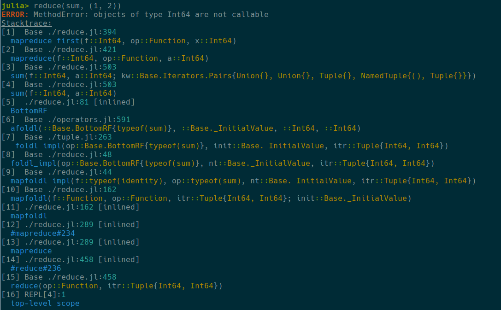
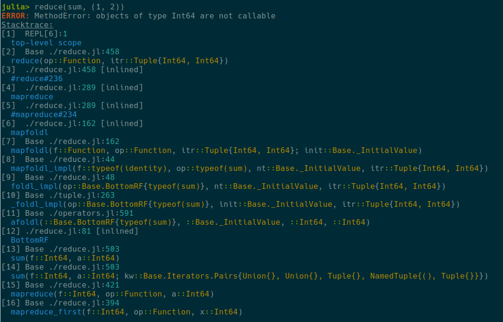

# Reverse logging

By default Julia prints stacktraces in descending order: first element in the stack displayed as the last line of the print. Since it can be not convenient sometimes, one can use `reverse` argument of the `NoRainbows.set_globals` to change the print direction. By default it is `false`.

## Examples of the `reverse` usage

This is standard printing of the stacktraces

```julia
NoRainbows.set_globals(reverse = false)
```


Here is reversed version of the same stacktraces, where first element of the stack is printed at the top

```julia
NoRainbows.set_globals(reverse = true)
```

